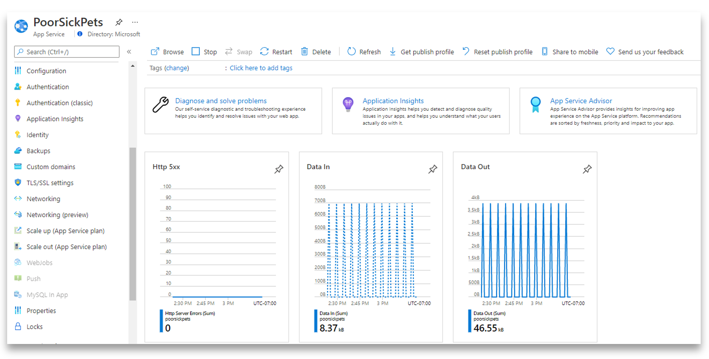
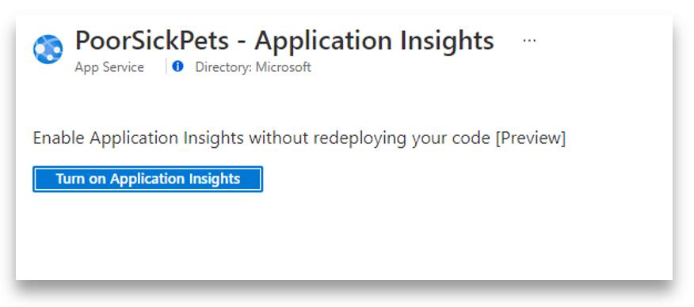
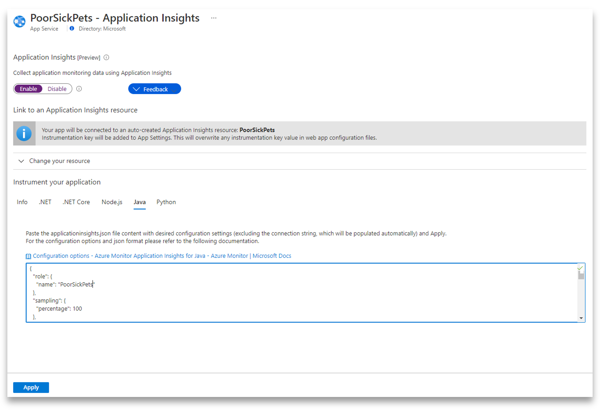
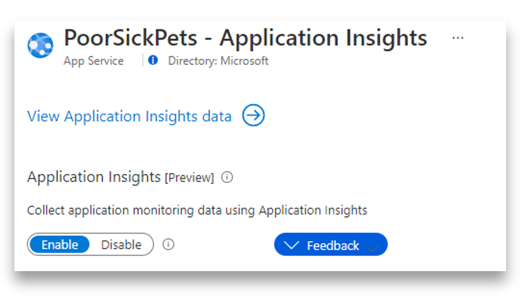

# 04 - Monitor Java EE application

__This guide is part of the [migrate Java EE app to Azure training](../README.md)__

Configure and monitor Java EE application and its dependencies using
Azure Monitor - Log Analytics and Application Insights.

---

## Enable application monitoring directly from Azure Portal

When you enable application monitoring, a Log Analytics workspace will also be automatically created for you unless you already have a different workspace that you prefer to use.

### Turn on Application Insights

Open your App Service resource in Azure portal. Click Applcation Insigths.



Click 'Turn on Application Insights'




Under 'Java' tab, you can [configure](https://docs.microsoft.com/azure/azure-monitor/app/java-standalone-config) your Application Insights - just paste the whole configuration file into the text box, leave out the configuration string though - see an example [here](https://docs.microsoft.com/azure/azure-monitor/app/java-standalone-config#an-example).



After clicking 'Apply' you can go to your Application Insights resource and see your telemetry starting to show up.



Live metrics is the bext place to start, you will see your telemetry in real time. For other useful views - performance, transactions, and more, give it a few minutes before everything falls into the right places.


## Monitor Java EE application

Navigate to the `Logs` blade. 
Type and run the following Kusto query to see application performance by operations:
```sql
// Operations performance 
// Calculate request count and duration by operations. 
// To create an alert for this query, click '+ New alert rule'
AppRequests
| summarize RequestsCount=sum(ItemCount), AverageDuration=avg(DurationMs), percentiles(DurationMs, 50, 95, 99) by OperationName, _ResourceId // you can replace 'OperationName' with another value to segment by a different property
| order by RequestsCount desc // order from highest to lower (descending)
```


Type and run the following Kusto query to see application logs:
```sql
AppServiceConsoleLogs
| project _ResourceId, OperationName, TimeGenerated, ResultDescription
```


Navigate to the `Performance` blade. You can
see application operation performance:


Click on `Dependencies` to view performance of SQL dependencies:


Click on one of the SQL dependencies and drill into it for end-to-end transaction details:


Click on `Application Map` blade to graphically visualize the call path and dependencies:


Click on `Live Metrics` blade to see metrics and insights with latencies less than 1 second:


---
  
⬅️ Previous guide:  [03 - Bind Java EE application to database](../step-03-bind-java-ee-app-to-database/README.md)

➡️ Next guide: [Conclusion](../step-99-conclusion/README.md)
